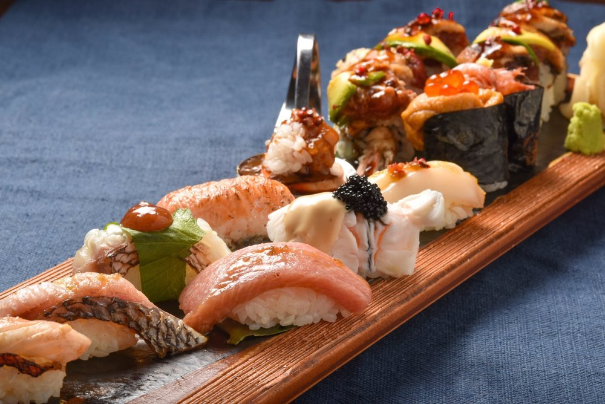
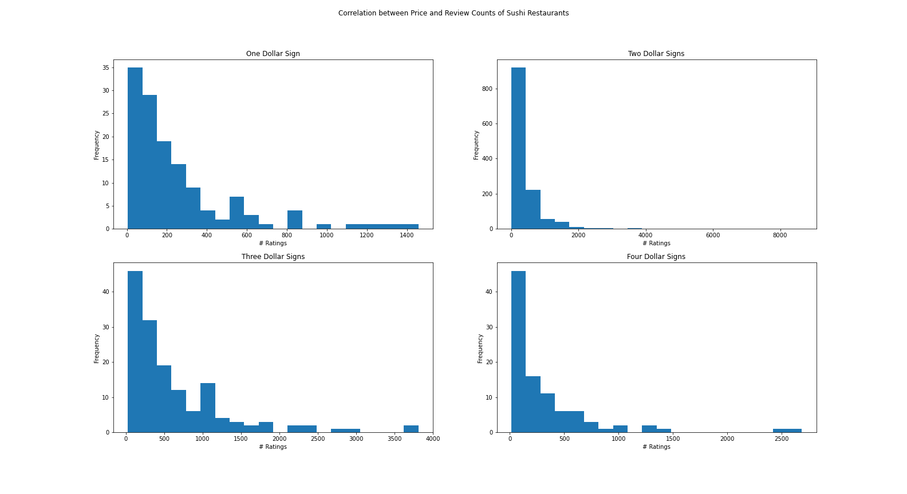

# wax_yelp_project
## Introduction
Students at Flatiron Data Science Intensive Bootcamp Feb 1 cohort 1 were tasked with analyzing data on businesses across two different industries or cities, creating findings, and making investment recommendations. This is their end of Phase 1 Project.

The pandemic has deeply depressed sales due to closures and lack of buying power, but as vaccine rollout continues and the economy recovers, we will see restaurants re-opening, especially speciality cuisines and luxury dining.

For my project I chose Sushi restaurants across NYC and Los Angeles.

## Yelp API
To gather business data, I created a python Jupyter notebook and created an implementation of the Yelp API. I gathered business data as well as reviews data.

https://www.yelp.com/developers/documentation/v3/get_started

## Methology
For slicing and analyzing data, I used Pandas and Numpy. I used Matplotlib for data visualization.

My rationale is that review count is a measure of popularity. If review count is high and rating is high, the business is likely to be successful.

I looked at overall distribution of ratings, correlations between price and rating, and correlations between price and review counts.

## Conclusion
My findings indicate that businesses with two dollar signs (i.e. medium cost) receive the most reviews, and that price is not indicative of the rating.

To stand the best chance of being successful, the shrewd investor should look at maximizing the traffic and popularity of the restaurant to attract interest. This means finding a location in a busy area and pricing the restaurant at a medium cost.

## Recommendations
Based on my criteria, I recommend the following restaurants:
NYC:
Izakaya MEW  |  2344 Reviews
Rating: 4  |  Price: $$  |  Zip Code: 10001

LA:
Daikokuya Little Tokyo  |  8641 Reviews
Rating: 4  |  Price: $$  |  Zip Code: 90012

Overall:
Daikokuya Little Tokyo